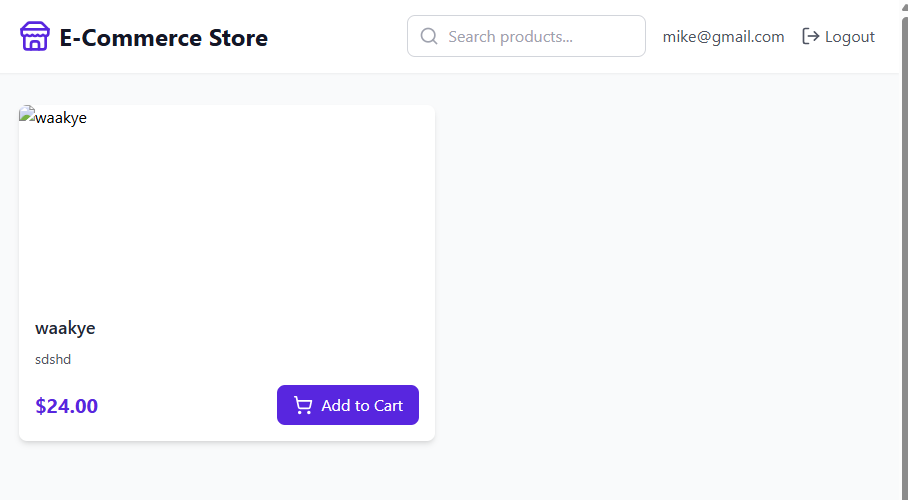

# E-Commerce Store Platform

A multi-tenant e-commerce platform built with React + TypeScript (Frontend) and Laravel + Filament (Backend).

## Prerequisites

- Node.js 18+ and npm

# Frontend Setup (React + TypeScript)

- Start server on the Laravel project before starting this

1. Install dependencies:

   ```bash
   npm install
   ```

2. Create `.env` file and configure the API URL:

   ```bash
   cp .env.example .env
   ```

3. Update the API URL in `.env`:

   ```
   VITE_API_URL=http://localhost:8000/api/v1
   ```

4. Start the development server:
   ```bash
   npm run dev
   ```

The frontend application will be available at `http://localhost:5173`.

## Features

- Multi-tenant architecture (each store has isolated data)
- Product management (Read only operations)
- Beautiful UI with Tailwind CSS
- Real-time data fetching with React Query
- TypeScript for better type safety
  
